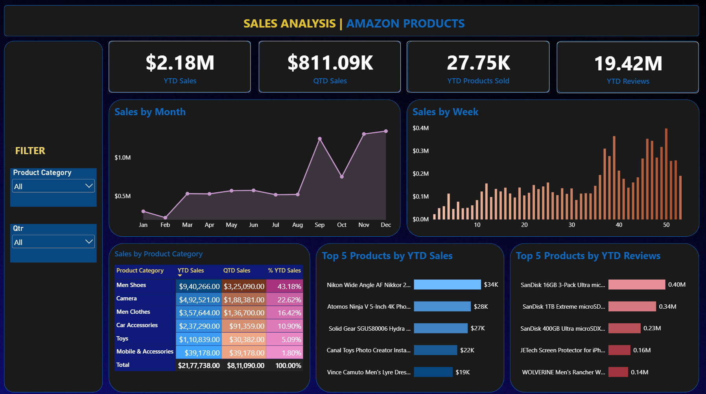

# 📊 Amazon Products Sales Analysis Dashboard

---

## 💡 Project Overview
An interactive Power BI dashboard analyzing across Amazon product categories. The dashboard tracks monthly/weekly sales trends, category performance, and top-performing products.

### Key Metrics Tracked
* **YTD Sales:** $2.18M
* **QTD Sales:** $811.09K
* **YTD Products Sold:** 27.75K units
* **YTD Reviews:** 19.42M reviews

---

## 🛠️ Technical Implementation

### 1. Data Transformation (Power Query)
* Cleaned and normalized Amazon product sales datasets.
* Configured custom date hierarchies and date tables for time-series analysis.

### 2. Data Modelling & DAX Measures
Created custom time-intelligence DAX measures:
* `YTD Sales = TOTALYTD(SUM(Amazon_Data[Price(Dollar)]),'Date Table'[Date])`
* `QTD Sales = TOTALQTD(SUM(Amazon_Data[Price(Dollar)]), 'Date Table'[Date])`
* `YTD Reviews = TOTALYTD(SUM(Amazon_Data[Number of  reviews]), 'Date Table'[Date])`
* `YTD Products Sold = TOTALYTD(COUNT(Amazon_Data[Product Category]), 'Date Table'[Date])`

### 3. Visualizations & Design
* **KPI Cards:** Displaying high-level metric summaries (YTD/QTD Sales, Units, Reviews).
* **Trend Analysis:** Line chart for monthly sales trajectories and column chart for week-by-week distributions.
* **Category Breakdown:** Custom matrix with conditional formatting showing YTD vs QTD category split.
* **Top 5 Ranking:** Bar charts showing top 5 products by revenue and reviews.
* **Interactive Slicers:** Dynamic filtering by Product Category and Quarter.

---

## 📁 Repository Structure
├── Amazon_Sales_Analysis.pbix  # Power BI Source File
├── Data/                       # Raw Datasets
├── Images/                     # Screenshots and visual assets
└── README.md                   # Project documentation
